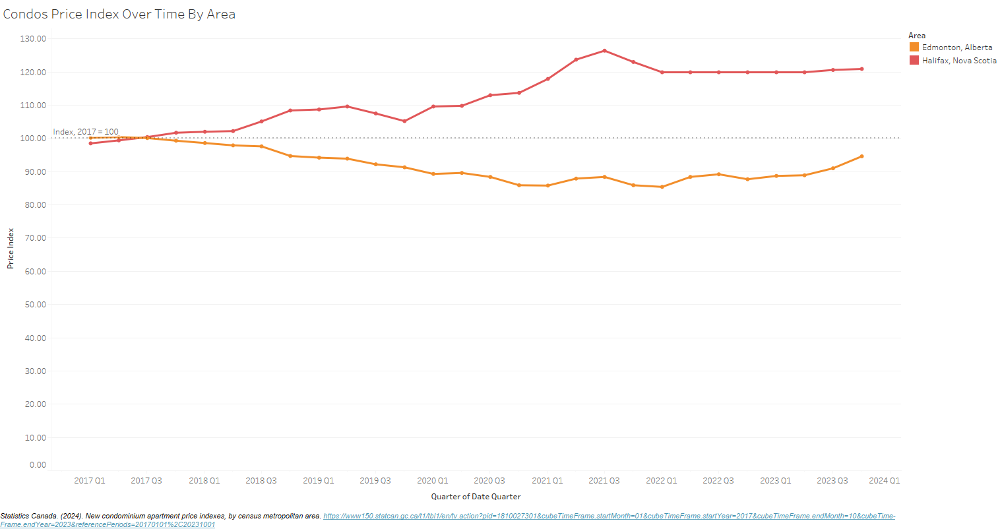
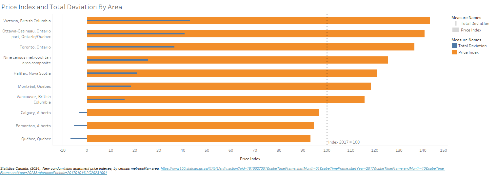
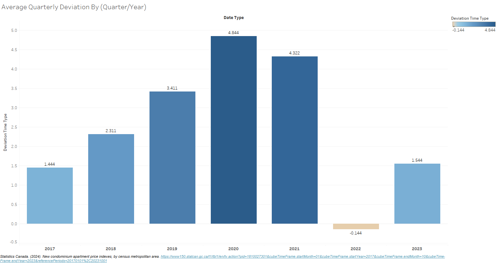
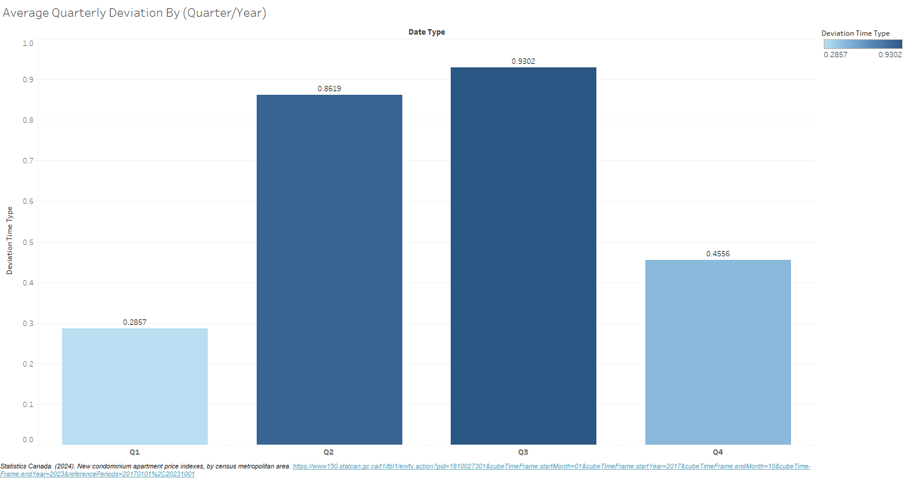
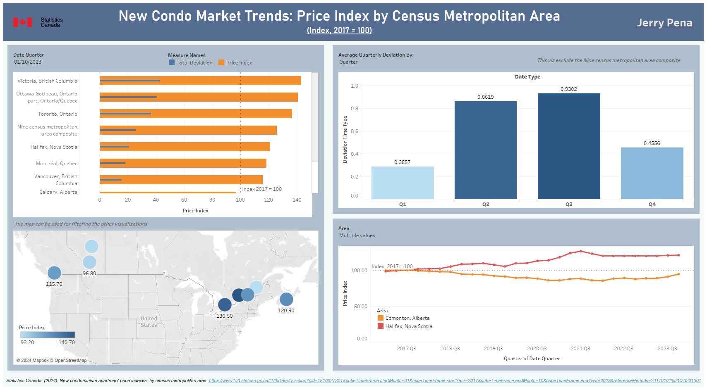

# Documentation: Analysis of New Condominium Apartment Price Indexes

### By Jerry Pena

## Introduction
The aspiration of homeownership is a goal cherished by nearly everyone, symbolizing a significant milestone in life. Yet, attaining this goal has become increasingly challenging across generations, a trend not exempting Canada. As highlighted by Desjardins (2019), the ratio of housing prices to rents in Canada has nearly doubled since 2015, underscoring a tangible hurdle.

It is in response to this evident challenge that this project takes shape. Our aim is to analyze time-based and geographic trends, as well as phenomena related to new condominium apartment prices in Canada. Through this exploration, we seek to gain insights into the evolving dynamics of the Canadian real estate landscape.

## Data Source

The dataset utilized for our analysis was sourced from Statistics Canada's website, specifically the New Condominium Apartment Price Indexes (NCAPI) dataset for various census metropolitan areas (CMAs). This dataset, accessible via the following link https://www150.statcan.gc.ca/t1/tbl1/en/tv.action?pid=1810027301, is described by Statistics Canada (2024) as follows:

    The New Condominium Apartment Price Index (NCAPI) is a quarterly series that measures changes over time in the developers' selling prices of units in new condominium apartment buildings in Halifax, Montréal, Québec City, Ottawa, Toronto, Calgary, Edmonton, Vancouver, Victoria, and for the composite of these nine census metropolitan areas (CMAs). The NCAPI starts in the first quarter of 2017.

It is crucial to note that the data spanned from 2017 to 2023, with the base year NCAPI value set at 100 in 2017. Furthermore, the data sources for this dataset were obtained directly from survey respondents and derived from various Statistics Canada surveys. For further insights into the dataset and its methodology, refer to the following URL: https://www23.statcan.gc.ca/imdb/p2SV.pl?Function=getSurvey&SDDS=5236. 

## Data Formatting

After downloading the data in csv format I made use of the python pandas library in order to fix the structure of the table. In the beginning the quarter dates were used as the column headers. That’s why I used the melt function in order to unpivot the quarter dates and create a new column for these dates and another one for the price index values respectively based also on the areas. The code can be found in the python folder as data_table_formatting.ipynb.

When the new formatted table was created as a new csv I moved to work with sql scripts in order to make some aggregations on the data. I chose PostgreSQL to do this task and created a new database called cad_condominiums. The primary keys for this table were two: area_part and date_quarter. All the sql files can be found in the sql folder. The next step was creating a table called cad_condo_prices and copying the data from the csv file to it. These queries are in the create_import_table.sql file. Then, in the queries_aggregate_deviations.sql file we started using the windows and aggregation functions. One of the values we calculated was the quarterly_deviation, which was calculated by subtracting the former price_index value from the current one using the LAG function. By summing the quarterly deviation and partitioning the operation either by area_part or area_part and year we got the total_deviation and yearly_deviation of the price indexes respectively.

After the aggregations we altered and updated the table to add more columns for the new calculations and their values. This can be found in the alter_new_columns_deviations.sql file.

## Data Analysis & Data Visualization

The database was connected successfully to Tableau in order to work with some visualisations. The first one made was a map with points representing the areas and the intensity of their colour representing the price index. This is a key graph since users of the dashboard can easily identify the area they are interested to get information about and based on that filter other graphs. 

There are two other charts: a time line and bar in bar chart of the price indexes of the different areas also showing the deviation they got over time.

|  | 
|:--:| 
| *Chart 1* |

|  | 
|:--:| 
| *Chart 2* |

Finally, by using parameters we got a bar chart in which users can change the values being displayed. It can either be a chart about the average quarterly deviation of prices by year or by quarters.

|  | 
|:--:| 
| *Chart 3* |

|  | 
|:--:| 
| *Chart 4* |

From these charts we can observe a high average quarterly deviation in 2020 and 2021, and the second and third quarter compared to other times. To use or download the dashboard with all the visualisations, it has been published to Tableau Public and this is its URL: https://public.tableau.com/app/profile/jerry.pena.alfaro/viz/NewCanadianCondoMarketTrends2017-2023/Dashboard?publish=yes

|  | 
|:--:| 
| *Dashboard 1* |

## Insights and Conclusions

Our initial observation regarding time indicates a significant increase in average deviation during the second and third quarters, corresponding to the spring and summer seasons, in contrast to other periods. This prompts an inquiry into how seasonal weather conditions influence the New Condominium Apartment Price Indexes (NCAPI).

Furthermore, our analysis reveals a continuous rise in the average NCAPI over the years, culminating in peak values during 2020 and 2021. While the impact of the COVID-19 pandemic is a plausible explanation, a thorough investigation into the correlation between these phenomena is necessary for a more substantiated conclusion.

Regarding geographical areas, a notable surge in NCAPI was observed towards the end of 2023, particularly in prominent cities such as Ottawa (the capital) and Toronto, with deviations of 40.7 and 36.5, respectively, compared to the 2017 baseline. To bolster this finding, a deeper exploration into the demographics and population dynamics of these regions is imperative.

## References

    Statistics Canada. Table 18-10-0273-01 New Condominium Apartment Price Indexes,  by Census metropolitan Area. DOI: https://doi.org/10.25318/1810027301-eng

    Dejardins, J. (2019) Mapped: The Countries With the Highest Housing Bubble Risks. https://www.visualcapitalist.com/mapped-the-countries-with-the-highest-housing-bubble-risks/ 
